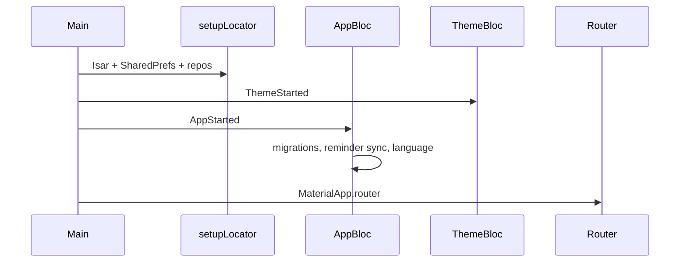

# LibretApp — Coding Phase Guide

Use this document while implementing features: it maps **where code lives**, **what each layer does**, and **which classes/functions to call**. For deeper architecture notes see [ARQUITECTURA.md](./ARQUITECTURA.md). For location/tenure domain details see [location.md](./location.md).

---

## 1. How to read the codebase (30 seconds)

| Question | Start here |
|----------|------------|
| App starts how? | `lib/main.dart` → `setupLocator()` → `LibretApp` / `MyApp` |
| Where is a screen? | `lib/core/router/app_routes.dart` (path) → `lib/app/app_router.dart` (widget + BLoCs) |
| Where is business logic? | `**/bloc/*_bloc.dart` (UI state) and `**/domain/**` (rules/contracts) |
| Where is persistence? | `**/infrastructure/**` (Isar repos) + `lib/core/database/isar_database.dart` |
| How do I get a dependency? | `locator<T>()` from `lib/core/di/injection.dart` after `setupLocator()` |
| Clean imports? | Barrels: `core/core.dart`, `app/app_index.dart`, `features/<name>/<name>.dart` |

**Layer rule (Clean Architecture):**

```
view/ widgets/     →  only UI + dispatch BLoC events
bloc/ application/ →  state machines; call repositories/services
domain/            →  entities, enums, repository interfaces (no Flutter)
infrastructure/    →  Isar models, DTOs, repository implementations
```

Never import `infrastructure/` from a `view/` file directly — go through a BLoC or a domain port registered in DI.

---

## 2. Top-level folder map

```
libretapp/lib/
├── main.dart                 # Bootstrap, DI, ThemeBloc + AppBloc
├── app/                      # Shell, router, app-level BLoCs
├── core/                     # Shared infra (DI, DB, router, security, widgets)
├── features/                 # Feature modules (one folder per product area)
├── theme/                    # Material 3 themes
└── l10n/                     # Generated localizations (ARB → Dart)
```

### Feature modules (`lib/features/`)

| Module | Barrel import | Role |
|--------|---------------|------|
| `directorio/` | `features/directorio/directorio.dart` | Animals, batches (lotes), directorio tabs + search |
| `ubicaciones/` | `features/ubicaciones/ubicaciones.dart` | Paddocks, crops, inventory, location records |
| `agenda/` | `features/agenda/agenda.dart` | Calendar tasks / reminders |
| `inicio/` | `features/inicio/inicio.dart` | Home dashboard KPIs |
| `registro/` | `features/registro/registro.dart` | Quick record entry hub (weight, health, etc.) |
| `finanzas/` | `features/finanzas/finanzas.dart` | Income & general expenses |
| `perfil/` | `features/perfil/perfil.dart` | Farm profile & settings |
| `exportar/` | `features/exportar/exportar.dart` | Data export UI |

Typical feature layout:

```
features/<name>/
├── <name>.dart          # barrel export
├── domain/              # entities, enums, repository contracts
├── infrastructure/      # Isar *Repository, isar/ models, migrations
├── bloc/ or application/  # BLoC + event/state
├── view/                # pages
└── widgets/             # feature-specific UI
```

`directorio` nests sub-features: `animales/`, `lotes/`, plus coordinating `bloc/` at directorio root.

---

## 3. Startup sequence



| Step | File | What happens |
|------|------|----------------|
| 1 | `main.dart` | `WidgetsFlutterBinding`, edge-to-edge UI, error handlers |
| 2 | `injection.dart` | `IsarDatabase.initialize()`, register all singletons |
| 3 | `main.dart` (debug) | `seedMockAnimals()` optional demo data |
| 4 | `AppBloc` | One-time event purge, `AgendaReminderSyncService`, `LocationEnumMigrationService`, locale → `AppReady` |
| 5 | `ThemeBloc` | Load saved `ThemeMode` from `ThemeRepository` |
| 6 | `app.dart` | `MaterialApp.router` with `router` from `app_router.dart` |

---

## 4. Navigation & shell

### Bottom tabs (index → route)

| Index | Route path | Route name | Main widget |
|-------|------------|------------|-------------|
| 0 | `/directorio` | `directorio` | `DirectorioView` (+ 5 BLoCs) |
| 1 | `/agenda` | `agenda_page` | `AgendaPage` |
| 2 | `/` | `inicio` | `InicioPage` (center home) |
| 3 | `/ubicaciones` | `ubicaciones` | `UbicacionesPage` |
| 4 | `/perfil` | `perfil` | `PerfilPage` |

Defined in `app_shell.dart` and wired in `app_router.dart` via `StatefulShellRoute.indexedStack`.

### Full-screen overlays (no bottom tab)

Reachable with `context.pushNamed(...)` — slide-in from right (`_buildOverlayDetailPage`):

| Path prefix | Examples |
|-------------|----------|
| `/registro` | peso, sanitario, produccion, tratar-lote, … |
| `/finanzas` | Financial summary |
| `/exportar` | Export |
| Nested under `/directorio` | animal detail, lote detail, forms |
| Nested under `/ubicaciones` | location detail, edit |

**Path helpers:** use `AppRoutes.animalDetallePath(uuid)`, `AppRoutes.ubicacionDetallePath(uuid)`, etc. in `lib/core/router/app_routes.dart`.

**Navigate:** `context.goNamed(AppRoutes.nameInicio)` or `context.pushNamed(AppRoutes.nameAnimalDetalle, pathParameters: {'uuid': id})`.

---

## 5. Dependency injection (`setupLocator`)

Access: `import 'package:libretapp/core/di/injection.dart';` then `locator<AnimalRepository>()`.

| Type registered | Implementation | Used for |
|-----------------|----------------|----------|
| `IsarDatabase` | singleton | All Isar access |
| `SharedPrefsService` | singleton | Settings, flags, profile |
| `AnimalRepository` | `AnimalRepositoryIsar` | Animals CRUD, streams, stats |
| `LotesRepository` | `LotesRepositoryIsar` | Batch/lote management |
| `LocationRepository` | `IsarLocationRepository` | Locations, crops, inventory |
| `AgendaRepository` | `IsarAgendaRepository` | Calendar entries |
| `*RecordRepository` (×7) | `*RecordRepositoryIsar` | Per-animal records (weight, health, …) |
| `FinanzasRepository` | `IsarFinanzasRepository` | Income / general expenses |
| `PerfilRepository` | `PerfilSharedPrefsRepository` | Farm profile |
| `ThemeRepository` | — | Light/dark/system persistence |
| `BackupService` / `ExportService` | — | Backup & Excel export |
| `InicioDashboardService` | — | Dashboard aggregation |
| `AgendaReminderSyncService` | — | Auto tasks from animal records |
| `LocationEnumMigrationService` | — | One-time enum string migration |
| Security ports | native or stub crypto | Tokens, auth (future sync) |

**Compile-time flags** (`injection.dart`):

- `LIBRET_RESET_LOCAL_DB` — wipe Isar (non-release only)
- `LIBRET_ALLOW_INSECURE_CRYPTO_IN_RELEASE` — allow crypto stub in release

BLoCs are **not** in GetIt — they are created in `app_router.dart` or page `BlocProvider`s.

---

## 6. State management catalog (BLoCs)

Pattern: `Widget` → `context.read<XBloc>().add(SomeEvent())` → `BlocBuilder` / `BlocListener`.

### App-wide

| BLoC | Events (main) | Responsibility |
|------|---------------|----------------|
| `AppBloc` | `AppStarted`, `AppLanguageChanged` | Startup migrations, locale, reminder sync |
| `ThemeBloc` | `ThemeStarted`, `ThemeModeChanged` | Persist & apply `ThemeMode` |

### By feature

| BLoC | Location | Events (summary) | Responsibility |
|------|----------|------------------|----------------|
| `DirectorioBloc` | `directorio/bloc/` | `ChangeDirectorioTab`, `StartSearch`, `PerformCombinedSearch`, `ClearSearch`, `LoadDirectorioData` | Tab index + cross-tab search |
| `AnimalesBloc` | `animales/bloc/` | `LoadAnimales`, `AddAnimal`, `UpdateAnimal`, `DeleteAnimal`, search/selection/pagination events | Animal list state |
| `AnimalesTabBloc` | `directorio/bloc/` | Tab-specific filters for animals | Directorio animals tab UI |
| `LotesBloc` | `lotes/bloc/` | Load/save/delete lotes | Lote CRUD |
| `LotesTabBloc` | `directorio/bloc/` | Tab state for lotes | Directorio lotes tab |
| `UbicacionesTabBloc` | `directorio/bloc/` | Tab state for ubicaciones in directorio | Embedded location tab |
| `AnimalBloc` | `animales/application/bloc/` | Load animal + records, save updates | Single animal detail |
| `UbicacionesBloc` | `ubicaciones/bloc/` | Load locations, `AddVisitRecordEvent`, crop/inventory events, etc. | Location list & detail mutations |
| `AgendaBloc` | `agenda/bloc/` | `LoadAgenda`, `AddAgendaEntry`, `UpdateAgendaEntry`, `DeleteAgendaEntry`, `SearchAgenda`, `MarkAnimalCompleted` | Calendar |
| `InicioBloc` | `inicio/bloc/` | `LoadInicio` | Dashboard cards |
| `RegistroBloc` | `registro/bloc/` | `RegistroPesoSubmitted`, `RegistroSanitarioSubmitted`, … `RegistroReset` | Submit records from registro hub |
| `FinanzasBloc` | `finanzas/application/` | Load/add/delete income & expenses | Finanzas screen |
| `PerfilBloc` | `perfil/bloc/` | Load/save profile fields | Perfil screen |

**Router-provided BLoCs:** opening `/directorio` creates `AnimalesBloc`, `AnimalesTabBloc`, `LotesBloc`, `LotesTabBloc`, `UbicacionesTabBloc`, `DirectorioBloc` together. Animal detail route creates a scoped `AnimalBloc`.

---

## 7. Data layer — repository APIs

Contracts live in `domain/` or `infrastructure/*_repository.dart`; implementations in `*_repository_isar.dart`.

### `AnimalRepository`

| Method | Purpose |
|--------|---------|
| `watchAll()` / `watchChanges()` | Reactive list for BLoC streams |
| `getAll()` / `getPage(offset, limit)` | One-shot reads / pagination |
| `getByUuid` / `getBySpecies` / `getByPaddock` / `getByBatchUuid` | Queries |
| `getAnimalsRequiringAttention()` / `getUnsynchronized()` | Filters |
| `save` / `update` / `delete` | CRUD |
| `refreshFromRemote({force})` | Sync hook (mock in debug) |
| `markAsSynced` / `markAsUnsynchronized` | Sync flags |
| `getStatistics()` / `count()` / `clearAll()` | Aggregates & maintenance |

### Animal record repositories (one per record type)

Each follows the same idea: `watchByAnimal(uuid)`, `getByAnimal`, `add`, `update`, `delete` — see:

- `WeightRecordRepository`
- `HealthRecordRepository`
- `ProductionRecordRepository`
- `ReproductionRecordRepository`
- `CommercialRecordRepository`
- `MovementRecordRepository`
- `CostRecordRepository`

Implementations: `lib/features/directorio/animales/infrastructure/*_repository_isar.dart`.

### `LotesRepository`

Batch entities linked to animals — CRUD via `lotes/infrastructure/lotes_repository.dart` (see `LotesBloc` for usage).

### `LocationRepository`

| Method group | Purpose |
|--------------|---------|
| `watchAll`, `getAll`, `getByUuid`, `upsert`, `deleteByUuid` | Location tree |
| `addVisit`, `addWater`, `addSalt`, `addShade`, `addPasture`, … | Operational records |
| `addCrop`, `updateCrop`, `deleteCrop`, harvest/watering/health/task | Crop management |
| `addInventoryItem`, `updateInventoryItem`, `removeInventoryItem` | Inventory |

UI dispatches matching `UbicacionesEvent`s; BLoC calls these methods.

### `AgendaRepository`

Agenda entries — `IsarAgendaRepository`; used by `AgendaBloc` and `AgendaReminderSyncService`.

### `FinanzasRepository`

| Method | Purpose |
|--------|---------|
| `getIncomes` / `addIncome` / `deleteIncome` | Farm income |
| `getExpenses` / `addExpense` / `deleteExpense` | General expenses |

Animal-level costs use `CostRecordRepository`, not `FinanzasRepository`.

### `PerfilRepository`

Farm metadata in SharedPreferences — `PerfilSharedPrefsRepository`.

---

## 8. Core services (cross-cutting)

| Service | File | Main API |
|---------|------|----------|
| `LoggerService` | `core/services/logger_service.dart` | `i`, `w`, `e` with tag + optional stack |
| `SharedPrefsService` | `core/services/shared_prefs_service.dart` | Typed get/set; keys in `prefs_keys.dart` |
| `ThemeRepository` | `core/services/theme_repository.dart` | `loadThemeMode` / `saveThemeMode` |
| `BackupService` | `core/services/backup_service.dart` | Export/import JSON backup |
| `ExportService` | `core/services/export_service.dart` | Excel export (animals, locations, agenda) |
| `IsarDatabase` | `core/database/isar_database.dart` | `initialize()`, `isar`, `clearAllCollections()` |
| `PerformanceMonitor` / tracers | `core/performance/` | Debug startup & navigation KPIs |
| Security (`CryptoPort`, `AuthPort`, …) | `core/security/` | Native FFI crypto or debug stub |

---

## 9. Feature entry points (where to edit)

### Directorio / Animales

| Task | Go to |
|------|--------|
| Animal list UI | `animales/view/animales_list_view.dart` |
| Register / edit animal | `register_animal_page.dart`, `animal_create_form.dart` |
| Animal detail tabs | `animales/view/` + `widgets/info_tab.dart`, `records_tab.dart` |
| Assign location/batch | `animal_assignment_sheet.dart`, `location_batch_sheet.dart` |
| Entity fields | `domain/entities/animal_entity.dart` |
| Isar schema | `infrastructure/isar/isar_animal.dart` (+ run build_runner) |
| DTO mapping | `infrastructure/animal_dto.dart`, `animal_repository_isar.dart` |

### Lotes

| Task | Go to |
|------|--------|
| List / cards | `lotes/lotes_list_view.dart`, `lote_card.dart` |
| Detail / form | `view/lote_detail_page.dart`, `lote_form_page.dart` |
| State | `lotes/bloc/lotes_bloc.dart` |

### Ubicaciones

| Task | Go to |
|------|--------|
| List | `view/ubicaciones_view.dart` |
| Detail + records | `view/location_detail_page.dart`, `location_record_sheets.dart` |
| Form | `view/location_form_page.dart`, `widgets/location_form_sheet.dart` |
| Enums (category, tenure, water) | `domain/enums/` |
| Labels for UI | `widgets/location_labels.dart` |

### Registro (quick capture)

| Task | Go to |
|------|--------|
| Hub menu | `view/registro_page.dart` |
| Per-type pages | `view/registro_*_page.dart` |
| Submit logic | `bloc/registro_bloc.dart` + `Registro*Submitted` events |

### Agenda / Inicio / Finanzas / Exportar

| Area | Main page | State |
|------|-----------|-------|
| Agenda | `agenda/view/agenda_page.dart` | `AgendaBloc` |
| Inicio | `inicio/view/inicio_page.dart` | `InicioBloc` + `InicioDashboardService` |
| Finanzas | `finanzas/view/finanzas_page.dart` | `FinanzasBloc` |
| Exportar | `exportar/view/exportar_page.dart` | Uses `ExportService` directly |

---

## 10. Conventions for new code

1. **New screen** → add path + name to `AppRoutes` → register `GoRoute` in `app_router.dart` → create page under `features/<x>/view/`.
2. **New persisted entity** → `domain/entities/` → Isar class in `infrastructure/isar/` → repository interface + `*_isar.dart` → register in `injection.dart` → BLoC events/states.
3. **New tab action** → prefer extending existing BLoC; avoid `setState` for domain data.
4. **Imports** → export from feature barrel when reused across feature boundaries.
5. **Strings** → add ARB keys under `lib/l10n/` and run `flutter gen-l10n`.
6. **Tests** → mirror path under `test/features/...` (see existing `ubicaciones_bloc_test.dart`, etc.).

---

## 11. Find anything quickly

| I need… | Command / location |
|---------|-------------------|
| A class definition | IDE “Go to symbol” or search `class Foo` in `lib/` |
| Who uses a repository | Search `locator<AnimalRepository>` or `AnimalRepository>` |
| Route for a page | `app_routes.dart` then `app_router.dart` |
| Isar collection | `infrastructure/isar/isar_*.dart` |
| Generated Isar code | `*.g.dart` (do not edit by hand) |
| DI registration | `grep` symbol in `injection.dart` |

**Regenerate Isar / JSON:**

```bash
cd libretapp
dart run build_runner build --delete-conflicting-outputs
```

**Run tests:**

```bash
cd libretapp
flutter test
```

---

## 12. Related documentation

| Document | Contents |
|----------|----------|
| [ARQUITECTURA.md](./ARQUITECTURA.md) | Architecture, cleanup backlog (Spanish) |
| [location.md](./location.md) | Location model, tenure, categories |
| [../BARREL_FILE_GUIDE.md](../BARREL_FILE_GUIDE.md) | Barrel export patterns |
| [../../Contextop.md](../../Contextop.md) | Full project synthesis & debt register |
| [../PROJECT_SETUP_GUIDE.md](../PROJECT_SETUP_GUIDE.md) | Initial Flutter setup (partially dated) |

---

## 13. Checklist: “I’m adding a feature”

- [ ] Entity + enums in `domain/`
- [ ] Repository contract + Isar implementation
- [ ] Register in `injection.dart`
- [ ] BLoC events/states + tests if non-trivial
- [ ] View/page + widgets
- [ ] `AppRoutes` + `app_router.dart`
- [ ] Export from feature barrel
- [ ] l10n strings if user-visible
- [ ] Run `build_runner` if Isar models changed

*Last aligned with codebase layout: June 2026.*
